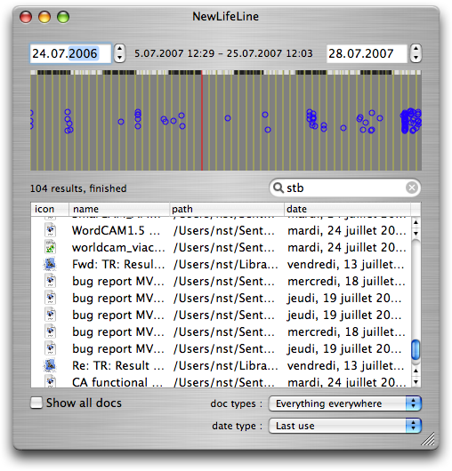
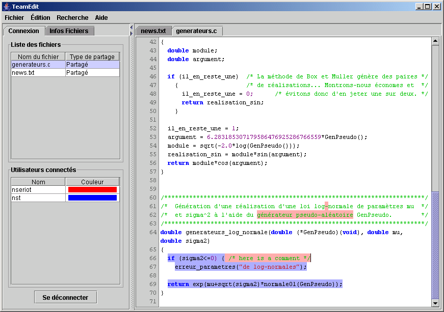
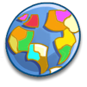
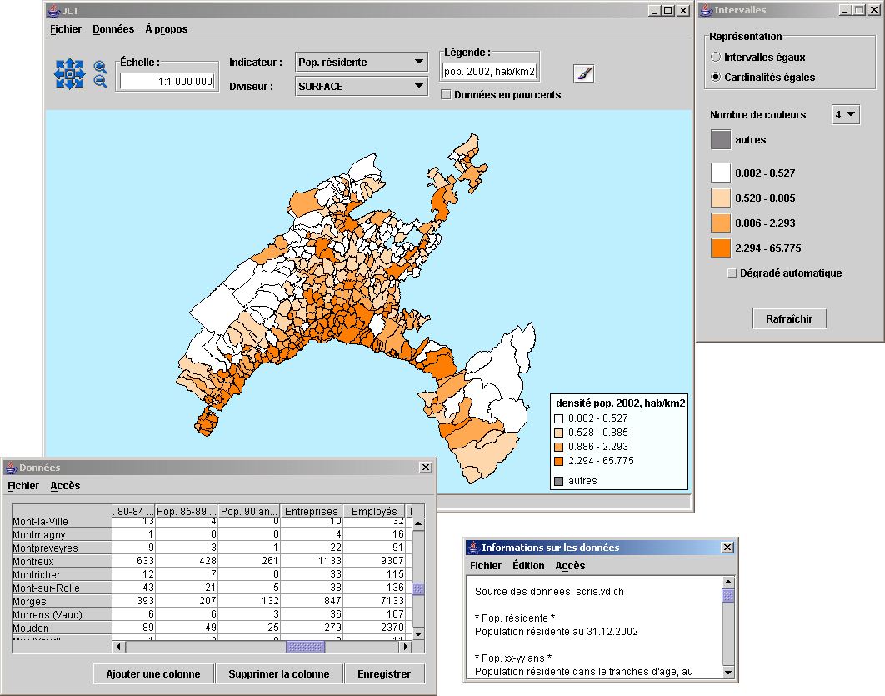
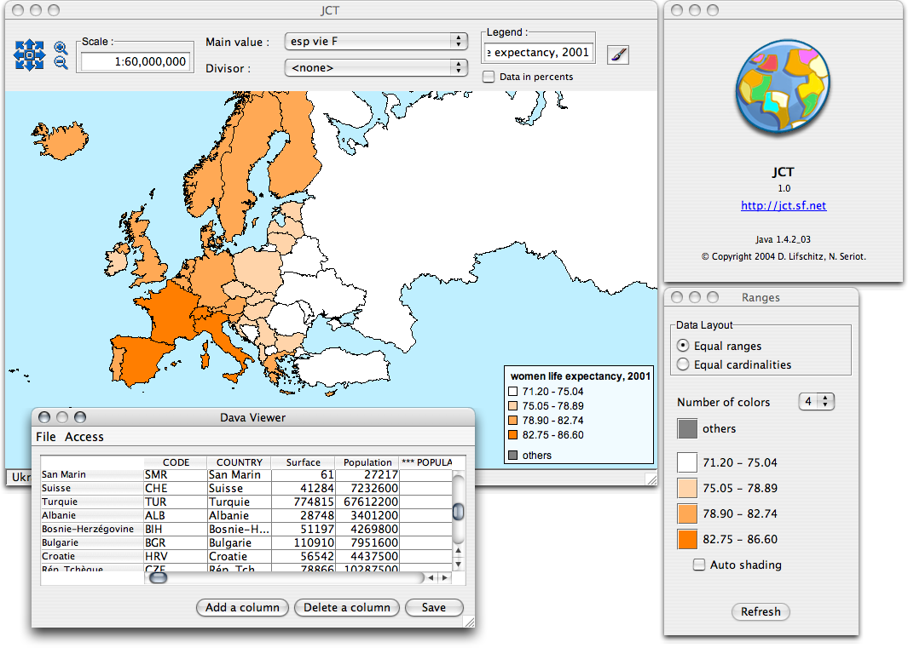
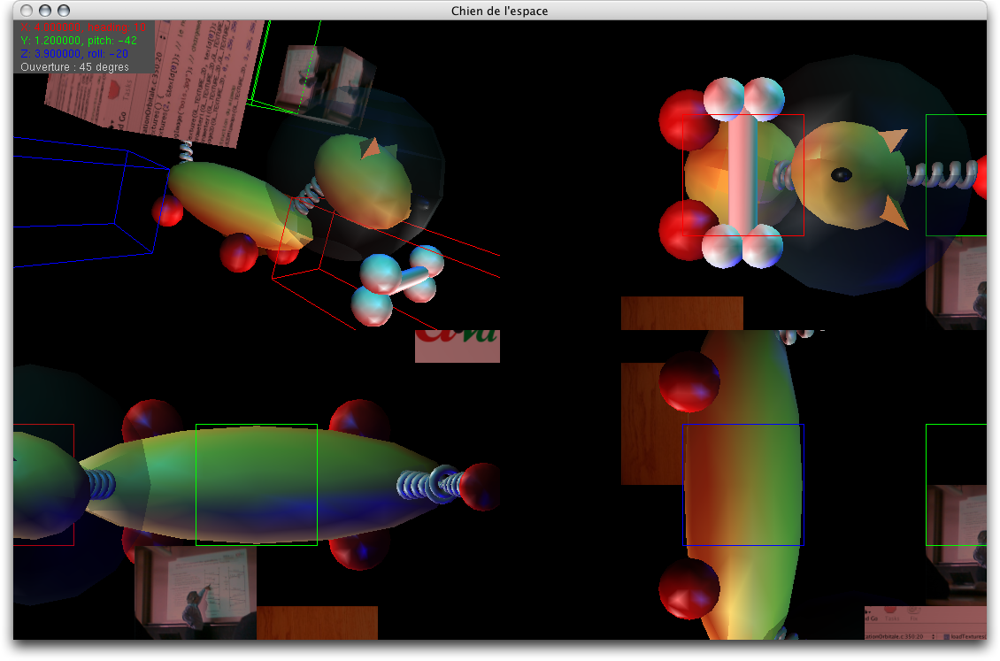
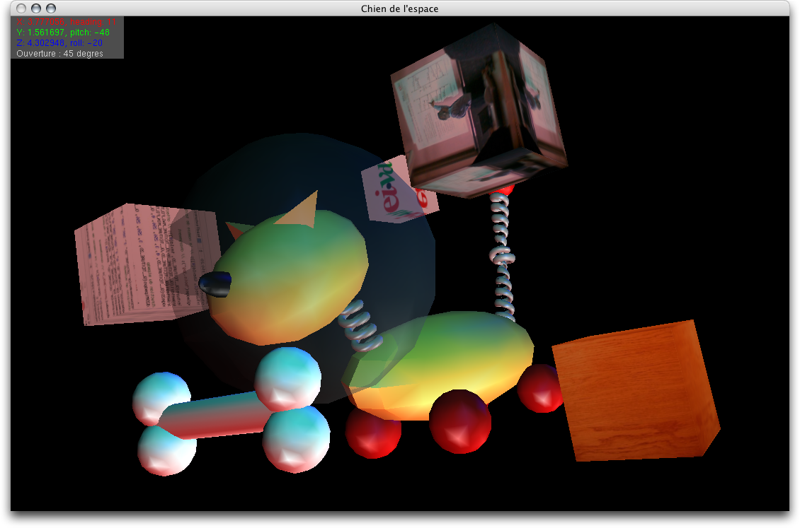

## HEIG-VD School Projects

I studied software engineering at [HEIG-VD](http://www.heig-vd.ch) engineering school, formerly known as EIVD, in 2002-2006.

Here are some selected projects I wrote during this time.

- 2005-12 [LifeLine](#lifeline)
- 2005-06 [TeamEdit](#teamedit)
- 2004-07 [JCT (Java Cartes Thématiques)](#jct)
- 2004-03 [SpaceDog (Chien de l'espace)](#spacedog)

<h3 id="lifeline">2005-12 LifeLine</h3>

Mac OS X Cocoa application to explore new ways to access files using metadata.

Work diploma at EIVD with the software company Sen:te. (grade 5.7/6). [poster](LifeLine/poster_lifeline.pdf)

In March 2008, I wrote an improved, opensource version of LifeLine called [SpotLook](http://code.google.com/p/spotlook/) for Mac OS X 10.5.

<h3 id="teamedit">2005-06 TeamEdit</h3>

Collaborative text editor, ala [SubEthaEdit](http://www.codingmonkeys.de/subethaedit/), but opensource and multiplatform, written at EIVD.

Thanks to [Daniel Lifschitz](http://daniel.li/) whithout who the project would never have reached this state on time. This project got the grade 6/6.

[Sourceforge project](http://teamedit.sourceforge.net/)  
Download binary: [teamedit-0.1.zip](http://prdownloads.sourceforge.net/teamedit/teamedit-0.1.zip?download)  
Download sources: [teamedit-src-0.1.zip](http://prdownloads.sourceforge.net/teamedit/teamedit-src-0.1.zip?download)

**[Update]** Although TeamEdit was the first opensource, multiplatform, collaborative text editor, it was more a proof of concept than a finished product. Such a software finally saw the light, it's [ACE](http://ace.iserver.ch/). "Cherry on top of the cake", it uses the [Bonjour](http://developer.apple.com/networking/bonjour/index.html) protocol.

<h3 id="jct">2004-07 JCT (Java Cartes Thématiques)</h3>

JCT is used in Canton de Vaud schools in geography teaching. It is usable by kids to draw thematic maps.

Semestre project written with [Daniel Lifschitz](http://daniel.li/) (grade: 5.9/6).

The code is interesting since there's only one compilation file to generate an executable suitable for every platform. Think of Mac OS X: its human interface guidelines require an icon, a menu bar at the top of the screen, and other properties that are not standard Java behaviors.

[JCT web page](http://jct.sourceforge.net/)  
[Sourceforge project](https://sourceforge.net/projects/jct/)  
[Development documentation](software/eivd/JCT/jct_development.pdf)

<h3 id="spacedog">2004-07 SpaceDog (Chien de l'espace)</h3>

EIVD Computer graphics project. Grade: 6/6.

This is a dog and is bone modelled in 3D. The user cas move in the scene, add fog, change the lighting, change the textures, change the number and the type of projections, and so on.

This project was written in several weeks, by adding every week the new concepts explained during the lessons.

[Sources C / OpenGL](SpaceDog/src/)  
[Projet Xcode](SpaceDog/src_xcode/)  
[Executables Windows / Mac OS X](SpaceDog/bin/)
